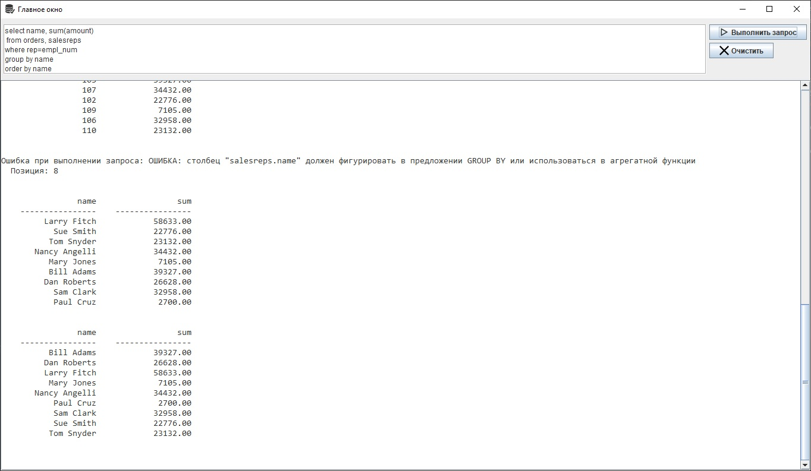
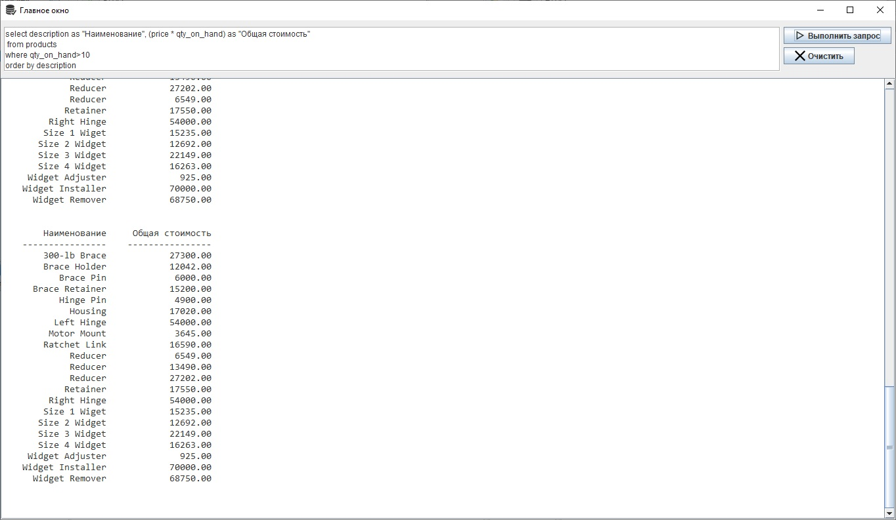

# ResourceDemo
Учебный проект для работы с БД

Я начал изучать SQL по книге "SQL Полное руководство" Д.Р. Грофф, П.Н. Вайнберг, Э. Оппель. Книга предполагает изучение языка на примерах 
работы с небольшой учебной базой данных. Саму БД я развернул на базе СУБД PostgreSQL. Данное приложение подключается к БД и позволяет
выполнять SQL-запросы и выводить их результаты в текстовую область (JTextArea).
В проекте всего два класса: ResourceDemo - создает и настраивает элементы интерфейса; и DataBaseConnector - устанавливает подключение к
базе данных и возвращает результаты запросов, которые затем форматируются и выводятся в текстовой области.

Также это первый для меня проект, в котором я исполузую maven

